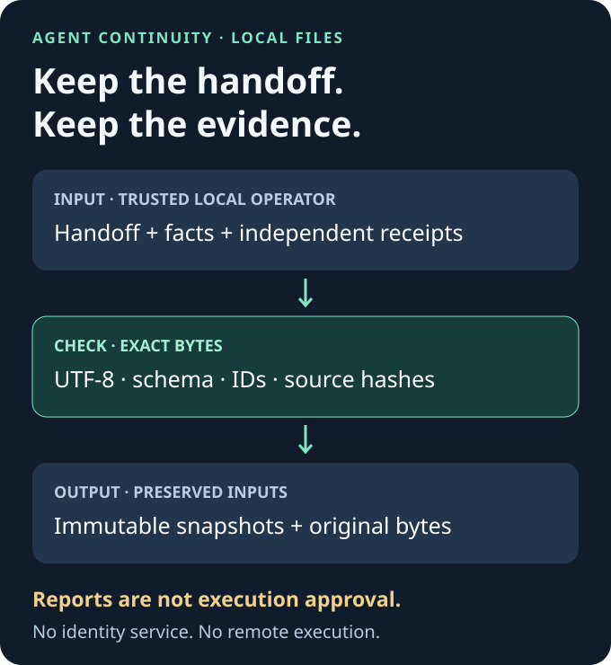
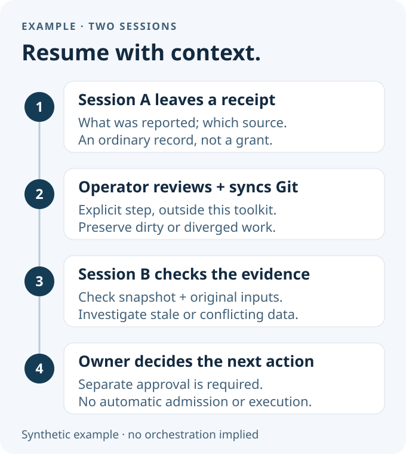

# Agent Continuity

**Resume agent work with inspectable receipts and byte-checked snapshots.**

A small, Git-friendly toolkit for preserving what was reported, which source it referred to, and the original handoff bytes—so the next reader has evidence to inspect.

[Quickstart](#try-it-locally) · [Setup guide](GUIDE.md) · [Safety boundary](#what-this-does-and-doesnt-do) · [简体中文](README.zh-CN.md)



**v0.1.0-rc.2 is a release candidate, not stable GA.** Local file integrity does not establish identity, truth or permission. No remote agent is enrolled and no action is authorized by a receipt.

## Why keep a receipt?

An agent says “done,” the session ends, and the next session sees a summary. Which source did “done” refer to? Did a later handoff get lost? Is the summary still current?

- **Independent receipts:** one immutable file per request ID. Exact retries are idempotent; changed content conflicts.
- **Preserved handoffs:** snapshots never replace `CURRENT_STATE.md`. Original bytes remain in digest-named archives.
- **Inspectable freshness:** `--check` verifies a snapshot against current local inputs. New or altered input cannot silently count as the same evidence.

## Try it locally

You need **Node.js 24+ and Git**. No package installation, API key, model call or service is needed.

```sh
git clone https://github.com/AAlpha7/agent-continuity.git
cd agent-continuity
node --test test/*.test.mjs
node scripts/agent-receipt.mjs fixtures/workspace fixtures/receipt.json
node scripts/build-continuity-snapshot.mjs fixtures/workspace demo-project
node scripts/build-continuity-snapshot.mjs fixtures/workspace demo-project --check
```

The bundled data is fictional. The existing receipt replays with `duplicate: true`; generation returns an immutable snapshot path; `--check` reports `snapshot: "current"`. These results are **local only**: `remote` remains `not-attempted`. A correctly formatted synthetic source revision is not proof that a real commit exists.

To start your own project, follow the [setup guide](GUIDE.md): prepare a UTF-8 handoff, initialize a **new** directory, review the history hash and receipt fields, generate, then check. Include `.gitattributes` in the first Git commit so clones preserve evidence bytes.

## A handoff you can inspect



1. **Session A leaves a receipt** for `synthetic-task-1`, reporting `received` against a declared source revision. That is a report, not an ownership grant.
2. **An operator explicitly synchronizes Git** after reviewing changes. Fetch alone does not update the working files; dirty or diverged work must be preserved and reconciled. This toolkit does not perform synchronization for you.
3. **Session B checks the local snapshot** and reads the linked unabridged handoff and receipts. Missing or changed inputs require investigation or explicit regeneration.
4. **The owner separately decides the next action.** A digest, claimed role or timestamp cannot authorize a new agent to execute.

## What this does and doesn't do

| Available in this release candidate | Outside the implemented boundary |
| --- | --- |
| Local immutable receipt files and exact-byte replay checks | Verified per-agent identity or member admission |
| Cooperative local locks and atomic file publication | Hostile same-account or cross-tenant isolation |
| Strict UTF-8, schema and hash checks | Proof that reported content is true |
| Separate immutable snapshots and preserved inputs | Signed approval, key management or revocation |
| Explicit local freshness checks | Automatic remote sync, task scheduling or multi-agent orchestration |

The CLI assumes a **trusted local OS operator**. Declared actor labels are data; they are never credentials. There is no remote intake or execution API. Do not expose these functions as an authenticated service: no such authentication is implemented.

A killed writer may leave a lock. Inspect and preserve the state before operator-approved recovery; never steal a lock based only on age or PID. Power-loss durability and network filesystems are not certified. An attacker able to rewrite both the evidence and its trusted baseline can conceal changes. See the [coordination protocol](PROTOCOL.md) and [validation limits](TESTING.md).

## Evidence you can check

- **15 local tests passed, zero failed/skipped** on Windows with Node 24.11.1. Run them yourself; this is not a hosted-CI badge or performance benchmark.
- The Git portability regression initializes a real repository, freshly clones with `core.autocrlf=true`, verifies every payload hash, replays/checks the demo and runs a separate 12-test subset. See [TESTING.md](TESTING.md).
- [MANIFEST.json](MANIFEST.json) inventories distributed bytes. [PROVENANCE.json](PROVENANCE.json) separates source Git blobs, optional checkout observations and explicit extraction transformations. Verifying historical source blobs requires authorized access to that source checkout; public tests do not.

## Read further

| Need | Start here |
| --- | --- |
| Initialize your ledger; understand STALE, CORRUPT and CONFLICT | [Setup guide](GUIDE.md) |
| Receipt fields and canonical bytes | [Receipt schema](RECEIPT-SCHEMA.md) |
| Coordinator handoffs and unresolved ownership | [Protocol](PROTOCOL.md) |
| Reproduce tests and understand limits | [Testing](TESTING.md) |
| Attribution and dependencies | [License and dependencies](RIGHTS-AND-DEPENDENCIES.md) |

Future exploration may compare duplicate claims, interrupted work and stale conclusions using a fixed-budget offline three-worker simulation. Ownership enforcement and learning from failures are **future work**, not features of v0.1. Mock outcomes would not establish real-LLM performance.

## License

[MIT](LICENSE) · Copyright © 2026 [AAlpha7](https://github.com/AAlpha7).
Code, documentation and the original diagrams use the same license. Node.js and Git are separate prerequisites; their distributions are not bundled. `private: true` prevents accidental npm publication; this repository is public source under MIT.
