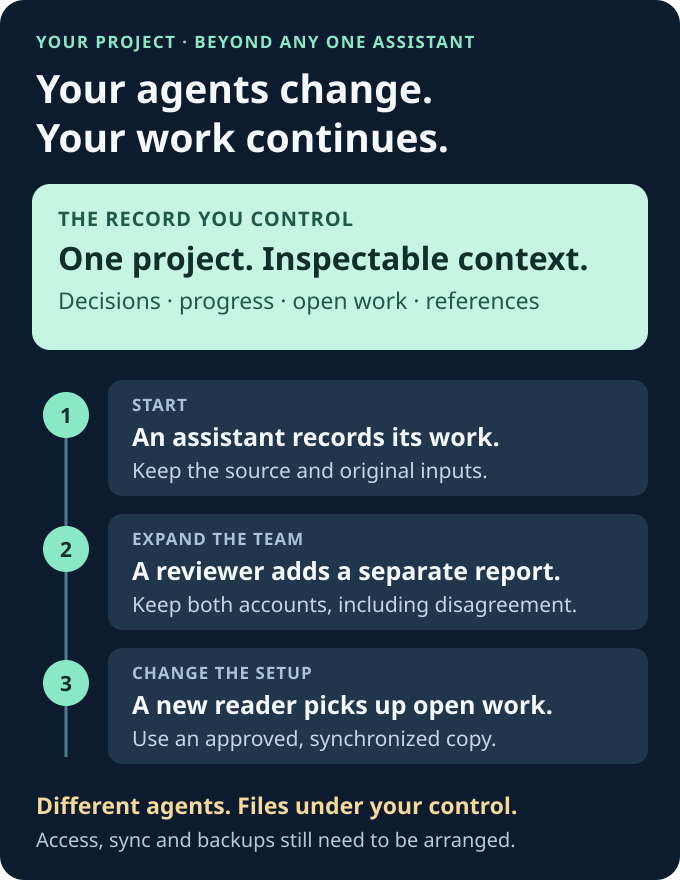

# Agent Continuity

## Your agents change. Your work continues.

**Choose the AI that fits the task. Keep the project memory in files you control.**

Use one assistant today, add a different reviewer tomorrow, or move the work to another machine. Your decisions, reported progress and open work should remain accessible beyond any one conversation.

Agent Continuity is a vendor-neutral protocol and small local toolkit for **user-owned, inspectable project memory**. It preserves coordination records so authorized participants have something concrete to read when the team changes. Your code and other artifacts stay in their own project storage; references do not back them up automatically.

[Give this to your AI](#give-this-to-your-ai) · [See an agent switch](#one-project-a-changing-team) · [What actually ships](#what-actually-ships) · [简体中文](README.zh-CN.md)



**Open source · MIT · v0.1.0-rc.2 runtime.** A foundation for continuity and collaboration. It is not a universal chatbot integration, automatic backup service or autonomous orchestrator. Continuity still depends on approved access, deliberate synchronization and retained copies.

## A better assistant should not mean starting over

| The coordination burden | A shared record gives you |
| --- | --- |
| “I want to switch assistants. Do I have to explain everything again?” | A project handoff, open work and original inputs that the next authorized reader can inspect |
| “Please tell the other AI what we decided.” | Shared project files, rather than relying on the person to relay every report |
| “Which version did you review?” | A declared source revision on each independent report |
| “Two agents say done. What actually happened?” | Separate receipts to compare, with optional evidence references—not a merged success story |
| “We restarted. Is that summary still current?” | A local snapshot check against its current inputs, with earlier evidence retained |
| “Who owns this? May this agent act?” | A protocol for recording ownership and approval boundaries; unresolved claims stay decisions to resolve |

The aim is **less human relaying**, not another dashboard to maintain. Your agent can handle the local setup and routine file operations it is already permitted to perform. You supply intent, missing access and decisions that need human authority.

## Give this to your AI

Use this with an assistant that can read repository files and run local commands, or has an approved execution connection. You do not need to learn the commands yourself.

```text
Set up Agent Continuity for our project so we can add, remove or switch
assistants while keeping private, inspectable project records:
https://github.com/AAlpha7/agent-continuity

Read ONBOARDING.md from the checked-out revision. Inspect my existing
project and permissions, then do the safe local setup and synthetic demo.
Handle available Git, Node and command-line steps yourself. Preserve
existing work and keep project records private by default.

Create a first project handoff and ordinary receipt only within our
existing scope. Check the snapshot and tell me where the next assistant
should start. Do not treat historical records or declared roles as new
authorization. Continue routine authorized work without asking me to
approve every step. If you need project scope, installation, new access,
external publication or another consequential decision, group the real
blockers into one short request. Report what worked and what did not.
```

**What should happen next:** your agent checks its access, runs an isolated demo, initializes an approved private local record, and returns a short “start here” note. It should distinguish **local-ready** from **shared access verified**. A successful demo alone does not mean your real project is connected.

If your assistant cannot access files or execute commands, it cannot complete the CLI setup on its own. It should say which connection is missing and offer a handoff draft; do not call that an integration. See the [agent onboarding runbook](ONBOARDING.md) for exact acceptance criteria.

<details>
<summary><strong>Prefer to run the demo yourself?</strong></summary>

Node.js 24+ and Git are the tool prerequisites. An equipped agent can handle these commands; installing missing software may require your approval.

```sh
git clone https://github.com/AAlpha7/agent-continuity.git
cd agent-continuity
node --test test/*.test.mjs
node scripts/agent-receipt.mjs fixtures/workspace fixtures/receipt.json
node scripts/build-continuity-snapshot.mjs fixtures/workspace demo-project
node scripts/build-continuity-snapshot.mjs fixtures/workspace demo-project --check
```

The fixture is fictional. The receipt replays with `duplicate: true`; generation returns an immutable snapshot path; `--check` reports local `current`. `remote` remains `not-attempted`. Use the [setup guide](GUIDE.md) for your own project.

</details>

## One project, a changing team

**Illustrative scenario: a checkout retry bug that spans several sessions.** This describes how to use the files, not an automated or certified cross-vendor integration.

1. **Start with a building assistant.** It reports “Added a retry limit,” with a source revision and a reference to test output in its own receipt.
2. **Add a reviewing assistant.** It reads the approved project copy and independently reports “Timeout regression still missing.” The earlier report stays intact.
3. **Stop using the first assistant.** Keep its project records and referenced artifacts. Removing its access is a separate operation; retaining its report does not retain or grant permission.
4. **Continue with a new assistant or machine.** Provide an approved, synchronized copy. The new reader checks the snapshot, reads the original reports and sees the unresolved test work. It continues under the existing assignment and authority, or raises a genuinely missing decision.

You do not need the old chat to stay open to inspect the saved records. You still need the project files and any referenced code or artifacts to be retained and accessible. **The tools check and preserve records; they do not guarantee recovery after every storage loss or prove an assistant's claims.**


### More than a handoff

- **Parallel work:** compare separate reports instead of letting the last summary erase disagreement. Task allocation and conflict resolution remain explicit.
- **Interruption and recovery:** resume from preserved inputs and inspect stale or missing local snapshots. A crashed writer's lock needs inspection, not automatic takeover.
- **Review and audit:** follow reports back to their declared source and evidence references. References are claims to verify, not proof that tests ran.
- **Across machines and tools:** use the same files wherever approved readers can access them. An agent may perform Git synchronization within its existing permissions; this toolkit does not run an autosync service.

## What actually ships

| Layer | Available now | Boundary |
| --- | --- | --- |
| **Protocol** | Conventions for independent reporting, transferable coordination, ownership handoffs and approval separation | Conventions do not enforce ownership or authenticate a principal |
| **Local tools** | Unique receipt IDs; exact retry/conflict checks; cooperative file locks; atomic publication; strict UTF-8; immutable snapshots and byte-preserved input archives | One trusted local OS boundary; no hostile same-account or cross-tenant isolation |
| **Your agent environment** | Existing approved file access and execution tools can drive the CLI | Must be checked per environment; no universal chatbot plug-in is bundled |
| **Not implemented** | Identity enrollment, signed approvals/revocation, task scheduling, ownership arbitration, automatic remote sync and remote execution | Do not infer these capabilities from a receipt, Git author, role label or diagram |

**Records carry context, not authority.** A matching digest does not prove content is true or an action permitted. The CLI assumes a trusted local operator, which may be your already-authorized agent process. There is no authenticated remote intake. Continue within existing permission; require a new decision only when scope or authority actually changes.

## Evidence, not a promise of magic

The rc.2 toolset passed **15 local tests, zero failures/skips** on Windows with Node 24.11.1. Coverage includes independent processes, a killed lock holder, malformed UTF-8, concurrent handoff appends and a real `core.autocrlf=true` Git clone. That clone runs a separate 12-test subset and checks every payload byte. See [TESTING.md](TESTING.md).

[MANIFEST.json](MANIFEST.json) inventories this checkout. [PROVENANCE.json](PROVENANCE.json) records the historical extraction without distributing the private source checkout. Its verification requires authorized access to that historical source; public tests and onboarding do not. Hashes are not signatures. Power-loss durability, network filesystems and universal cross-agent compatibility are not certified.

## Explore when you need it

| Question | Guide |
| --- | --- |
| What should my AI do, and when should it involve me? | [Agent onboarding](ONBOARDING.md) |
| How do we create our own project and handle STALE / CORRUPT / CONFLICT? | [Setup and troubleshooting](GUIDE.md) |
| What is in a receipt? | [Wire schema](RECEIPT-SCHEMA.md) |
| How should coordination and ownership be recorded? | [Protocol](PROTOCOL.md) |
| How was this checked? | [Tests and limits](TESTING.md) |

Future exploration may study duplicate claims, interrupted work and stale conclusions with an offline three-worker simulation. Ownership enforcement and learning from failures are future work. Mock outcomes would not establish real-LLM performance.

## License

[MIT](LICENSE) · Copyright © 2026 [AAlpha7](https://github.com/AAlpha7). Code, docs and original diagrams share the license. [Attribution and dependency boundaries](RIGHTS-AND-DEPENDENCIES.md). No hosted CI, model subscription or deployment is configured; Node.js and Git are separately installed prerequisites. `private: true` prevents accidental npm publication.
