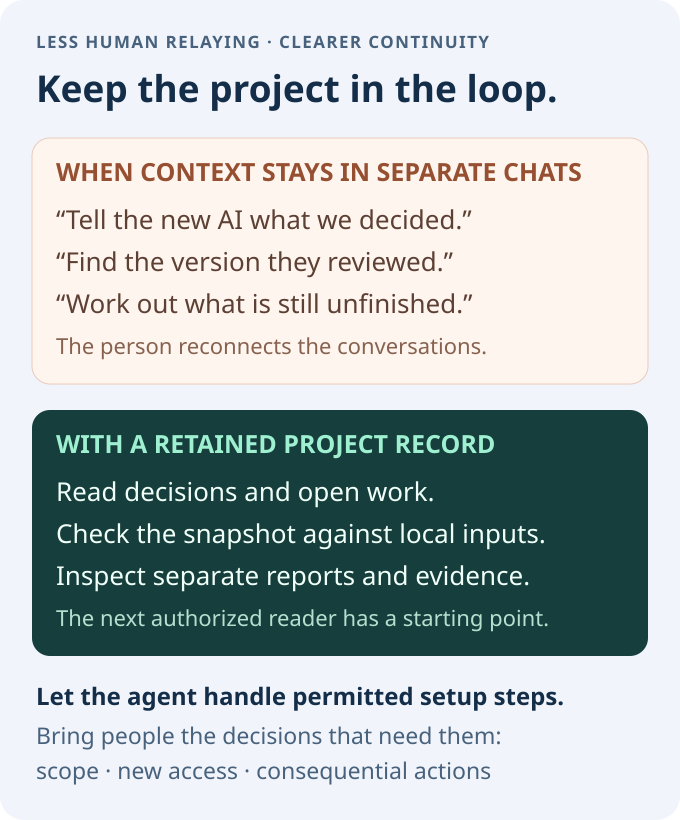

# Agent Continuity

## AI 随你选，工作接着走。

**换 AI，换协作组合，换机器。工作继续向前。**

这家的 AI 擅长写代码，那家的更会审查；明天的新模型，又让你想试一试。你可能同时用几个代理，也会在电脑、服务器和不同工作环境间切换。可它们往往不知道彼此做过什么：换一个就要重新解释，几个一起用就得来回传话。旧会话结束，决定和未完成的工作也可能留在那里。

Continuity 让持续的 AI 协作留在你自己掌握的记录里，**跨项目、跨 AI 团队、跨工具，也跨机器。** 每个项目都有不依赖于某个代理、AI 品牌或机器的共同记录。把**目标、决定、责任记录、进展、成果引用和未完成事项**留在你掌握的文件中，让获准成员围绕同一份已保存证据持续协作。几个代理一起做、职责发生变化、加入新伙伴、停用旧代理，或者换到另一台机器和环境，都不必重建整段项目背景。前提是这些记录已保存，并对获准参与者保持可访问。

[**把这段交给你的 AI →**](#把这段交给你的-ai) · [看看怎么协作](#多个项目不断变化的伙伴) · [English](README.md)


*MIT · 0.1.0-rc.3 预发布。产品图标用于说明使用生态，不代表每个产品都已通过集成测试。见[素材归属](docs/assets/ATTRIBUTION.md)。*

## 少一点转述，多一点继续。

| 你想…… | 下一位代理能找到什么 |
| --- | --- |
| **同时推进几个项目** | 各自的目标、决策、进度和待办；证据与访问范围保持区分 |
| **试试更合适的模型** | 已保存的决定与理由，不必重新做一遍背景介绍 |
| **让几个 AI 分工** | 各自独立的报告和来源版本，分歧不会被最后一份总结抹掉 |
| **换机器、过几天再继续** | 获准项目副本里的未完成工作和原始证据 |
| **确认“真的做完了吗”** | 原始回执、检查过的版本和可核对的成果引用 |

**最少步骤 — 这就是全部安装：**

共同记录就是你的私有账本。建立时把协调协议放进这个账本。之后的每个代理只用这个 URL 加入。

1. 第一个代理：**建立（Setup）**。它创建私有账本，把协议按原文字节复制进去，把本机克隆路径和远程 URL 写入用户级指令，并返回 URL。
2. 之后的每个代理或每台机器：只用这个 URL **加入（Join）**。协议已经在账本里。同一用户之后的新会话还会从用户级指令里看到这两项路径，不必在文件系统里搜索账本。

有 git 和 GitHub 就够了。`gh` 可选。没有 GitHub 时，本地 git 账本也可以。不需要 Node。

下面的粘贴就是这条路径。[此外的检查](#可选检查)可以不做。不跑它们，建立和加入也算完成。

真正需要你参与的是项目目标、新增访问、重要外部操作，以及无法自行消除的范围分歧。

## 把这段交给你的 AI

适用于能读文件、运行本地命令，或已连接获准执行环境的代理：

```text
Set up https://github.com/AAlpha7/agent-continuity
```

代理阅读 [ONBOARDING.md](ONBOARDING.md)，确认你的项目和真正缺失的授权，在你自己的账号下建立私有账本。公开仓库只是只读工具来源，不接收你的记录。必要 GitHub 授权可能需要你在浏览器完成；不要在聊天中粘贴凭据。不需要 Node、模型 API key、监听器或高级测试。

新建需要批准确切账号、仓库和项目范围。发现一个仓库、拥有它、它是私有或有写权限，都不等于你同意复用。Join 使用你明确指定的现有账本及项目；更换协议或配置属于需要另行批准的迁移。保留已有配置、属性、协议与记录；新建失败即停，不覆盖或悄悄转为复用。

真实数据写入前，代理核实账号、owner/private、有效 fetch 和全部 push 目标。[可选 shell 辅助工具](scripts/prepare-new-ledger.sh)只为获准的新空克隆执行检查并写本地文件，不提交或推送；已授权连接器可做等效检查，不隐含更换认证。

Setup 留下五个文件：`.gitattributes`、原字节协议副本 `docs/PROTOCOL.md`、由 `templates/HOW_WE_COORDINATE.md` 填写的协调说明、由 `templates/LEDGER-README.md` 填写的根 `README.md`，以及真实项目的 `projects/PROJECT/CURRENT_STATE.md`。协议来源用实际复制目录的 `git rev-parse HEAD`，先核验 `git show HEAD:PROTOCOL.md` 与复制字节一致；未提交候选无法对应该提交时填 `unset`，另留内容摘要。根入口链接本地两份协议和真实状态路径。完成前回读文件，并在发布前再次核实目标。

完成后只返回这一行，URL 替换为真实私有账本地址。这一行交给下一位代理。下面的用户级指令写入不替代它：

```text
Join LEDGER_URL
```

下一位代理只拿这一行，从账本根 README 发现协议与项目，在当前会话授权内继续；不需要用户再给工具 URL 或隐藏路径。本地账本只在双方可访问同一文件系统时使用 `Join LEDGER_PATH`，不冒充跨机器同步。缺权限或缺根入口/协议文件要报告阻塞，不自动修复账本。

同一次完成里，建立代理还要把位置写入**用户级指令**：代理产品在该用户之后每个会话开始时、在任何文件夹里都会自动载入的指令文字。使用该代理产品自己的位置。已验证的例子：在 Grok Build（`grok` CLI）里这是文件 `~/.grok/AGENTS.md`（2026-10-07 Gate B 冷启动检查，3 个冷启动会话全部通过，见 [TESTING.md](TESTING.md)）。之后的冷启动会话按这段文字打开账本，并遵循账本里的 `docs/PROTOCOL.md`，不必用 glob、搜索或 read_file 去发现账本。这一步是附加步骤，不替代 Join 那一行，也不是要用户再转交的第二行。

只写**一块**。把每一处 `LEDGER_PATH` 换成这台机器上账本克隆的绝对路径。不要留下占位符。URL 里不要嵌入凭据。保存规则（保留其他指令、用同一标记替换已有块、不要把路径写进账本协议）在 [ONBOARDING.md](ONBOARDING.md)。下面两块英文与英文 README 相同，便于之后的会话读到同一段措辞：

已核实的远程存在时，替换每一处 `LEDGER_URL` 并写入：

```text
agent-continuity ledger (this user):
local_clone_path: LEDGER_PATH
remote_url: LEDGER_URL
shared_access: configured
On every new session, open this ledger before any filesystem search for it. Read, in order, the ledger root README.md, docs/HOW_WE_COORDINATE.md, and docs/PROTOCOL.md, then the project state those files link. Follow docs/PROTOCOL.md. When local_clone_path exists on this machine, read that directory. When it does not, clone remote_url with existing authorization and read that clone. Do not glob, search, or read_file to discover the ledger. Do not treat this note as new authority. Another agent Joins with: Join LEDGER_URL
end agent-continuity ledger
```

只有本地账本时，改为写入下面这一块。`remote_url: none` 和 `shared_access: not-configured` 保持这两个原样记号，同时仍要替换每一处 `LEDGER_PATH`：

```text
agent-continuity ledger (this user):
local_clone_path: LEDGER_PATH
remote_url: none
shared_access: not-configured
On every new session, open local_clone_path before any filesystem search for the ledger. Read, in order, the ledger root README.md, docs/HOW_WE_COORDINATE.md, and docs/PROTOCOL.md, then the project state those files link. Follow docs/PROTOCOL.md. Do not glob, search, or read_file to discover the ledger. Do not treat this note as new authority. There is no remote URL. shared_access is not-configured. Another agent on this same filesystem Joins with: Join LEDGER_PATH
end agent-continuity ledger
```

不要只用项目里的 `AGENTS.md` 来完成这一步。不要在项目里添加规则文件（例如 `.cursor/rules`），不要安装其他规则文件或常驻服务，也不要启动监听器或后台同步。把这一块写入用户级指令才是跨会话记忆步骤。`PROTOCOL.md` 和 Join 那一行都不变。若本会话无法编辑用户级指令，报告 `user_level_instructions: not-written`，并仍然返回 Join 那一行。不要把本地路径贴进公开 issue 或仓库。

## 可选检查

可以跳过。建立和加入已经完成。

### 快速协议检查

两个方向，各一轮。把下面这段交给已经共用这个账本的代理：

```text
可选协议检查，账本是 LEDGER_URL。这不是安装步骤。
第 1 轮：代理 A 在账本上给代理 B 写一条短记录。代理 B 在账本上回复。
第 2 轮：代理 B 在账本上给代理 A 写一条短记录。代理 A 在账本上回复。
每个方向只做一轮，然后停止。
```

### Shell 冒烟和 Node

在检查过的工具目录中：

```sh
sh scripts/ledger-smoke.sh
```

Windows 上用 Git Bash 或 WSL 运行同一脚本。本机对照脚本仍然可选：`powershell.exe -File scripts/ledger-smoke.ps1`。它用的是临时合成账本，不是你的项目。维护者：同一命令会拒绝缺少 `PROTOCOL.md` 原文字节的最少账本，并接受带有该字节副本的账本。它也接受省略可选协调模式附录的最少账本；在要求字节副本时，拒绝缺失或改写过的 `docs/COORDINATION_PATTERNS.md`；并接受与工具目录字节一致的副本，包括 `core.autocrlf=true` 克隆之后。采用者可以跳过。不需要 Node.js。

### 可选的协调模式附录

不属于建立或加入，也不是上面的粘贴块。八条原则已经随账本里的 `docs/PROTOCOL.md` 一起走。需要这些额外习惯的团队，可以把附录按原文字节复制进账本。不要改写成摘要，也不要把它加进建立或加入的粘贴块。

```sh
cp /path/to/inspected-toolkit/docs/COORDINATION_PATTERNS.md docs/COORDINATION_PATTERNS.md
git add docs/COORDINATION_PATTERNS.md
```

只有账本里已经有这份副本时，冷加入才会读到附录。文件不在时，加入仍从 `docs/PROTOCOL.md` 继续。附录里没有相对链接。见[协调模式](docs/COORDINATION_PATTERNS.md)。

如果已经安装了 Node.js 24+，也可以运行 127 项测试和合成演示。不要为了这个去安装 Node。演示目录必须尚不存在。

```sh
node --test test/*.test.mjs r2/test/*.test.mjs
node --input-type=module -e "import { cp } from 'node:fs/promises'; const dest='../agent-continuity-demo'; await cp('fixtures', dest, { recursive: true, errorOnExist: true, force: false });"
node scripts/agent-receipt.mjs ../agent-continuity-demo/workspace ../agent-continuity-demo/receipt.json
node scripts/build-continuity-snapshot.mjs ../agent-continuity-demo/workspace demo-project
node scripts/build-continuity-snapshot.mjs ../agent-continuity-demo/workspace demo-project --check
```

复制只把合成数据放到工具目录外，不建立远端。回执文件见 [GUIDE.md](GUIDE.md)。本地协调预览是 `node r2/demo.mjs`（[范围](r2/README.md)）。详见 [TESTING.md](TESTING.md)。

**维护者在每次发布前：** 把上面的可选路径都跑一遍 — 这次双代理互发、含协议字节检查的 shell 冒烟，以及有 Node 时的 Node 套件。如果建立／加入的粘贴文案改过，要用全新的代理、全新的环境重验最少步骤的建立和加入。shell 冒烟不是那次真人试用。不要复用以前的试用代理、试用虚拟机或试用账本仓库。把结果记入[发布核对清单](TESTING.md#maintainer-release-checklist)。采用者不用做。

## 多个项目，不断变化的伙伴

你可能一边开发产品，一边做研究，还在推进另一个计划。每个项目保留自己的目标、决策、各方贡献和未完成工作。让不同 AI 发挥各自长处，加入审查者、停用旧助手或换一台机器；获准的新参与者可以从已保存记录继续，不必每次重新听完整背景。交接只是持续协作中的一个时刻。

项目和任务范围让记录各归其位；多个项目的总览可以链接这些记录。这是一套基于文件的工作约定，不是自动项目调度器。责任记录让待认领工作更可见，不会自动执行分布式所有权或授予权限。

例如：构建代理报告修好了重试逻辑，并留下来源版本；审查代理发现还缺超时测试。你换了一个助手，它读取两份原始报告，保留分歧，按已批准的任务继续补检查。那些保存下来的项目记录，不需要旧聊天窗口一直开着。



### 支持的环境里，还可以用事件通知

**已在配置完成、所有者批准的环境中测试 OpenAI dot 和 Grok Bot 的 GitHub PR 事件通知。** 支持的监听入口可以提醒代理有变化；代理随后仍需读取真正的项目记录。

这是一组实际配置的测试，不是通用插件承诺。每位参与者的事件支持、监听配置和授权都要核实。本仓库不自动安装监听器、创建订阅，也不保证即时送达；不支持事件时，可以显式调用代理和同步记录。见[通知说明](docs/NOTIFICATIONS.md)。

## rc.3 带来了什么

- **你自己的项目记忆：** 独立不可变回执、原文按字节保留、可检查的本地快照。
- **下一位能用的入口：** 私有账本 URL。加入时只克隆这个 URL，并阅读 `docs/PROTOCOL.md`、`docs/HOW_WE_COORDINATE.md` 和 `CURRENT_STATE.md`。建立时还会把本机克隆路径和这个 URL 写入用户级指令（例如 Grok Build 的 `~/.grok/AGENTS.md`），使同一用户之后的会话不必搜索就能打开账本。
- **本地协调预览：** 限额动作、明确终止、持久终止发送记录、逐接收方状态和可恢复视图；只在一个受信本地控制器内工作。
- **以后可以自己核对的证据：** 来源版本、冲突与原样重放检查，以及可选的 Node 套件。不需要模型订阅或托管服务。

### 为什么可以试

这套测试有 **127 项：84 项本地协调／分发、15 项回执／快照兼容，以及 10 项 Windows 文件系统失败回归，以及 17 项入门安全与 1 项清单覆盖检查**，覆盖真实进程竞争与中断、复制控制器拒绝、严格字节校验及 Windows `core.autocrlf=true` 克隆。核心和解包器经过独立审查。真实新代理私库试验先暴露了工具分发缺口；修复后，新的接收方完成了规范回执和快照收尾，旧记录保留。采用者可以不跑这些测试。维护者在每次发布前连同其他可选路径一起跑。见[测试范围](TESTING.md)。

### 需要知道的边界

记录和引用的成果必须保存且可访问；引用不会自动备份文件。本地快照通过检查，也不代表远端最新或总结事实最新，要阅读原始报告并主动同步。

声明的角色、Git 作者、相同摘要都不等于身份认证、事实证明或操作授权。本地控制器不是远端执行／身份服务，也不是分布式所有权系统。不会恢复供应商聊天窗口、自动接通所有封闭聊天产品、安装自动同步服务或保证送达。访问变更和控制器接管需要单独明确。

## 用到时再展开

[接入与权限](ONBOARDING.md) · [可选检查](TESTING.md) · [回执格式](RECEIPT-SCHEMA.md) · [协议](PROTOCOL.md) · [可选协调模式](docs/COORDINATION_PATTERNS.md) · [可选的 Node 初始化](GUIDE.md) · [本地协调预览](r2/README.md) · [文件校验清单](MANIFEST.json)

## 许可与作者

[MIT](LICENSE) · © 2026 [AAlpha7](https://github.com/AAlpha7)。维护者 AAlpha7；[Lance · @xhuang26](https://x.com/xhuang26?s=11)。

代码、文档与原创项目图解采用 MIT。产品标识归各自权利人所有，仅作说明，不代表背书。见[权利与依赖](RIGHTS-AND-DEPENDENCIES.md)。不配置托管 CI、付费模型服务或自动部署。
